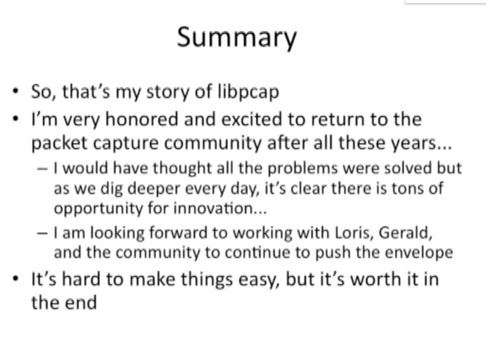
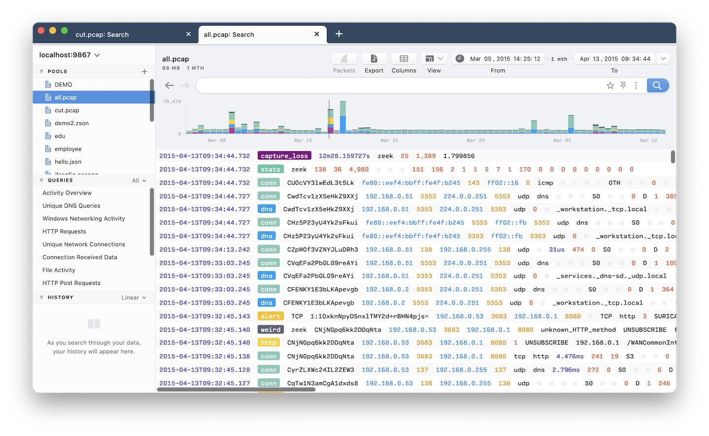
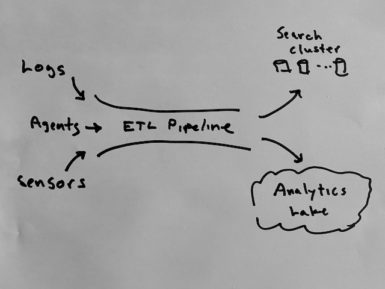
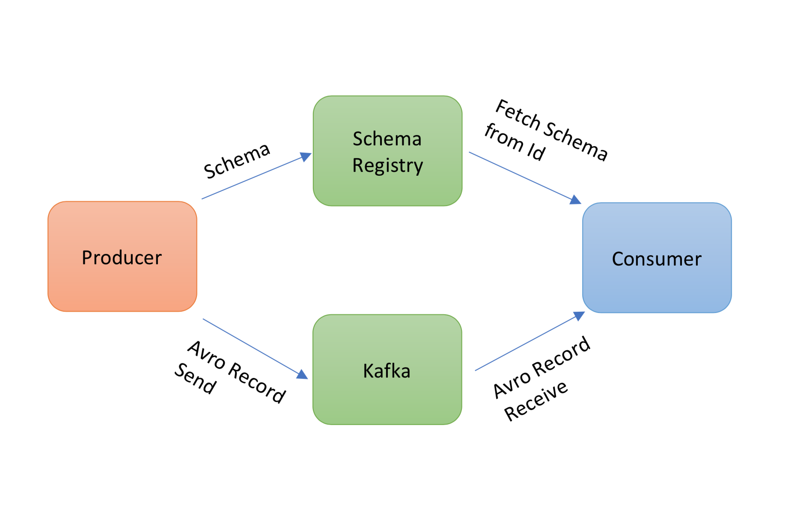
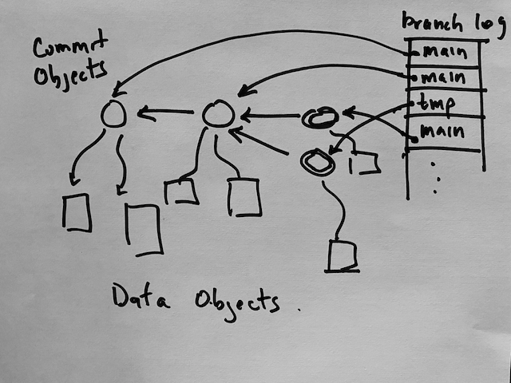

# The [Zed Project](https://github.com/brimdata/zed): Stumbling Upon a [New Data Model](https://github.com/brimdata/zed/blob/main/docs/formats/zson.md) while Hacking on Packets

> This README comprises a presentation I gave at Sharkfest '21
> at 8-9am on September 17, 2021.  You can reproduce all the examples
> herein from the tools referenced and files in this repo.
> In a sense, this is Part 2 of
> [my talk from 10 years ago](https://sharkfestus.wireshark.org/sf11)
> at Sharkfest '11.

## Abstract

If you've ever tried to assemble operational infrastructure for
search and analytics of network-oriented traffic logs, you know what a
daunting task this can be.  Roughly three years ago, we embarked upon a project
to explore search and analytics for [Zeek](https://zeek.org/)
and [Suricata](https://suricata.io/) "sensors" running on live
network taps or over archived [PCAP files](https://www.tcpdump.org/).
Having experimented extensively
with well-known, open-source search and analytics systems and after talking
to a wide range of practitioners of such tech stacks, we noticed a recurring
and compelling _design pattern_: a search cluster is often deployed to hold recent logs
for interactive queries, while some sort of data lake is deployed
in parallel to hold historical data for batch analytics.

We wondered if this bifurcation between search and analytics was fundamental
or if we could tackle this problem with a different approach.
We eventually concluded these silos arise, at least in part,
from the bifurcation of the underlying data models themselves:
search systems typically use the schema-less model of JSON while
analytics systems use more structured formats like Parquet (or relational tables),
enforcing _one-or-the-other_ design decisions.

In this talk, I'll describe a new data model called Zed --- designed to
unify the document model of JSON with the relational model of databases --
where our ultimate goal is to converge search, analytics, and ETL.
I will then discuss how we've leveraged the Zed data model
in a new query engine that operates over Zed data instead of JSON objects
or relational tables, and admits and a new query language that is a superset
of SQL and log-search style languages.  Finally, I'll outline our
_"work in progress"_ adapting the Zed system to a [Git-like](https://git-scm.com/)
data lake for cloud storage -- called a
[_Zed lake_](https://github.com/brimdata/zed/blob/main/docs/lake/README.md)
--- providing time travel, live ingest, search indexes, and
transactionally consistent views across distributed workers.

## Introduction

* Some ancient history: PCAP, BPF, tcpdump
* Ten years ago: Stanford Sharkfest '11 and Riverbed
* Present: Up and at 'em with Brim and Zed!
    * Your 50s sure are different from your early 40s... :)
    * But I think I still got something left!

## Sharkfest '11



## Zed & Brim

* Search-like experience optimized for Zeek and Suricata
    * [Zeek](https://zeek.org/) - maps packets to contectual logs
    * [Suricata](https://suricata.io/) - threat detections engine
* (quick demo of pcap drag into Brim)




## Our Research Team

We realized there was an interesting problem to explore here beyond
Zeek and Suricata
* Not a typical startup
* A multi-year, research effort
* An open-source project

We are just now transitioning from research to execution...

#### Front end
* James Kerr
* Mason Fish
#### Infrastructure
* Steve McCanne
* Noah Treuhaft
* Matt Nibecker
* Al Landrum (ex-Brim)
* Henri Dubois-Ferriere (ex-Brim)
#### Community + "Product" + Jack-of-all-trades
* Phil Rzewski
#### UC Berkeley Collaborators
* Amy Ousterhout
* Silvery Fu
* Sylvia Ratnasamy
* Joe Hellerstein

## Why not JSON + Elastic?

Douglas Crockford: [JSON](https://www.json.org/json-en.html)
* Just send a javascript data structure to a javascript entity
* _So much easier_ than XML, SOAP, RPC
* And [node.js](https://nodejs.org) arrived on the backend and we had _full stack_

Shay Banon: [Elastic](https://github.com/elastic)
* Wrap [Lucene Java lib](https://lucene.apache.org/) in a REST API
* Post JSON docs to API
* Submit JSON search queries to API

_It's hard to make things easy._

They did it.  Brilliant, easy, simple.

## The Catch

Works great for many simple uses cases.

But the simplicity of JSON is a double-edged sword
* limited data types (object, array, string, number, bool, null)
* no schemas in JSON ([JSON Schema](https://json-schema.org/) can be bolted on)
* suboptimal format for scaleable analytics

The more we worked on this problem, the more we were pulled in by the
Zeek data model.

For example, the Zeek TSV log format is rich and structured.
```
#fields	ts              uid                     id.orig_h       id.orig_p ...
#types  time            string                  addr            port      ...
1521911721.255387	C8Tful1TvM3Zf5x8fl	10.164.94.120	39681 ...
1521911721.411148	CXWfTK3LRdiuQxBbM6	10.47.25.80	50817 ...
```
But to get this structured data into Elastic...
* format as JSON and lose information
* configure extensive "mapping rules" in ingest pipeline
* mapping rules recover richness of data that was present but lost

(TODO: figure of this process)

[Corelight's ECS mapping repo](https://github.com/corelight/ecs-mapping)

This all creates complexity.

_It's hard to make things easy_

## The Bifurcation of Search and Analytics

Moreover, search is often not enough... need historical analytics

Leads to a bifurcation

* *Search*: OpenSearch, Elastic, Splunk
    * Unstructured logs or semistructured JSON
* *Analytics*: An Analytics Lake
    * "Cleaned-up data" in relational tables, e.g, ClickHouse, BigQuery, Snowflake
    * "Schema-siloed" Parquet files on S3



Each piece is
* easy enough and sensible by itself,
* but when you assemble the pieces, things get complex fast!

_It's hard to make things easy._

## Schemas to the Rescue

Make sure all data conforms to pre-design set of schemas
* Elastic can recover rich structure even with JSON intermediary
* Analytics organized around relational table with schemas
* Parquet files with schemas for efficient columnar analytics

But there's another catch...
* It's all quite fragile
* Need to keep schema design in sync with reality
* _The downstream stuff_ breaks when upstream things change

And why do you want to manage two different systems?

(TODO: figure of breakage)

## Policy & Mechanism

* An old adage says _you should separate policy from mechanism_
* Yet, Parquet and RDBMS tables combine schema with format
* If schemas are your policy for clean data _and_ tables are your mechanism,
then these approaches might just lead to headaches...

## Schema Declarations cause Cognitive Overload

Said another way...

* If you are declaring schemas before you can write data...
* If you are creating relational tables before you can query...
* If you are writing code to talk to a schema registry...

... then you are probably doing things the hard way.

Your extra effort comes from having to handle policy and mechanism _at the same time_.

_It's hard to make things easy._

## Zed: A Better Way

What if _the mechanism_ were _self-describing data_:

* A comprehensive type system
* First-class types
* Type-adaptive operators

And what if _the policy_ were enforced externally by the _type system_?

Then, a schema is simply a special case of a record type...

## Composable Tools

Before talking about the data model, let me outline the tools.

We have taken a very modular, "composable tools" approach
* CLI tools written in [Go](https://golang.org/)
* large set of simple verbs as commands
* fabulous for dev, test, debug
* bite-sized pieces for learning the system

> run `zed -h` and walk through commands briefly
> zed lake vs zed api

Like the `docker` command, everything packaged under the `zed` command, though there
are a couple shortcuts:
* `zq` - `zed query` operates on files and streams
* `zapi`- `zed api` client to talk to service

## A Zed Primer

Zed unifies the document-model of JSON with the relational model of SQL tables.

Let's start with JSON and we'll work our away over to relational tables.

We'll use `zq` to take an input, do no processing, and display it
in pretty-printed ZSON.

```
echo "..." | zq -Z -
```
Leverage the simplicity of JSON.
* Zed is a superset of JSON
* The human-readable form of Zed is called ZSON
* E.g., take Zed as input and pretty-print it:
```
echo '{"s":"hello","val":1,"a":[1,2],"b":true}' | zq -Z -
```
You will notice:
* don't need (but can have) quotes around field names
* otherwise, very familiar
* at the same time, very different

Field quotes needed only when there are special characters:
```
echo '{"funny@name":1}' | zq -Z -
```
Fully compatible with JSON:
```
echo '{"":1}' | zq -Z -
```

## Zed is statically typed

Unlike JSON, Zed is statically type and _comprehensive_

Here is a ZSON record with a bunch of different types of values:
```
zq -Z values.zson

{
        v1: 1,
        v2: 1.5,
        v3: 1 (uint8),
        v5: 2018-03-24T17:30:20.600852Z,
        v6: 2m30s,
        v7: 192.168.1.1,
        v8: 192.168.1.0/24,
        v9: [1,2,3],
        v10: [1(uint32),2(uint32),3(uint32)],
        v11: |["PUT","GET","POST"]|,
        v12: |{{"key1","value1"},{"key2","value2"}}|,
        v13: { a:1, r:{s1:"hello", s2:"world"}}
}
```
Notice:
* mostly implied types (like JSON)
* literal syntax is mostly unambiguous
* where there is ambiguity, _type decorators_ given in parens

Data is self describing.

No need to define a schema first and shoehorn it all in.

## A Challenge: Mixed-Type Arrays

If ZSON is
* a superset of JSON,
* but also statically typed,
* how do we handle mixed-type arrays?

Let's just have a look:
```
echo '{ A:["hello",1,"world",true,2,false] }' | zq -Z -
```
Dynamic array types can be distilled into a static union type!
```
echo '{ A:["hello",1,"world",true,2,false] }' | zq -Z "cut typeof(A)" -
```
This gives `[(int64,string,bool)]`!
* parentheses indicate a _union_ type
* so this is type _array_ of a _union_ of `int64`, `string`, and `bool`

Is all this important?
* Unions rarely encountered in practice
* But they can and do appear in JSON in the wild
* And they are useful in _data shaping_ and _fusing_

## First-class Types

You may have noticed: Zed _types_ are Zed _values_

The `typeof` operator can be applied to any field, e.g.,
```
zq -Z "cut t5:=typeof(v5), t6:=typeof(v6), t7:=typeof(v7), t12:=typeof(v12)" values.zson
```

What is the type of a type?
```
zq -Z "cut v5,T1:=typeof(v5) | T2:=typeof(T1)" values.zson
```
It's type _type_, of course!

Given first-class types, Henri had this brilliant idea:
```
count() by typeof(this)
```
* This gives you a count of each _data shape_ in the input.
* Super powerful tool for data introspection

Let's try this out on some Zeek logs:
```
zq -Z "count() by typeof(this)" zeek.zng
```
Ok, that's powerful but it would be more intuitive to see a sample
value of each type...  you can use the _any_ aggregator!
```
zq -Z "any(this) by typeof(this) | cut any" zeek.zng
```
We love this so much we call it _sample_:
```
zq -Z "sample" zeek.zng
```
And you can sample a field too...
```
zq -Z "sample id" zeek.zng
```

## The Zed Data Model

A sequence of records is valid ZSON
```
{a:1} {a:2} {s:"hello, world"}
```
* no need to put them in an array like JSON
* ZSON is a _superset of NDJSON

The Zed data model is simply:
> a sequence of statically typed, heterogeneous values

## Zed is a Superset of Relational Tables

Armed with this data model, we can tackle relational tables.

CSV is often used for tables, so here is a simple example:
```
cat employee.csv
zq -Z -i csv employee.csv
```
Note that `id` and `field` are floating point numbers by default
(CSV doesn't tell use the types of things).
```
zq -Z -i csv "by typeof(this)" employee.csv
```
Let's clean that up...
```
zq -Z -i csv "id:=int64(id),phone:=int64(phone)" employee.csv
```
and save cleaned data in a new file...
```
zq -z -i csv "id:=int64(id),phone:=int64(phone)" employee.csv > employee.zson
```
Now we have our relational table:
```
zq -f table  employee.zson
```

## Relational Zed

> Note: SQL support is currently experimental and early

The Zed language is a superset of SQL...

```
zq "SELECT name WHERE salary >= 250000" employee.zson
```

Note that a _table_ here is just a Zed type.

Let's look at another table...
```
zq -Z -i csv deals.csv
```
This time we'll clean it up through _shaping_:
```
zq -Z -i csv "type deal = {id:int64,name:string,customer:string,forecast:float64}; this:=cast(this,deal)" deals.csv
```
Note importantly the `(=deal)` type definition.

Let's shape both of the CSVs into a new file "tables.zson"...
```
zq -z -i csv "type deal = {id:int64,name:string,customer:string,forecast:float64}; this:=cast(this,deal)" deals.csv > tables.zson
zq -z -i csv "type employee = {id:int64,name:string,city:string,phone:int64,salary:float64}; this:=cast(this,employee)" employee.csv >> tables.zson
```

## SQL Tables as Zed Types

```
cat tables.zson
```
We can simply add a "FROM" clause to refer to a table by its type name:
```
zq -f table "SELECT name FROM employee WHERE salary >= 250000" tables.zson
zq -f table "SELECT name FROM deal WHERE forecast >= 200000" tables.zson
```
Of course, there is an easier way given the mixed nature of the Zed data model...
```
zq -f table "salary >= 250000 or forecast >= 200000" tables.zson
```

## SQL/Zed Joins

Since tables are just types, you can do JOINs too!

```
zq -f table "SELECT e.name AS NAME, d.forecast AS FORECAST FROM employee e JOIN deal d ON e.name=d.name" tables.zson
```
* You can aggregate too of course.  
* Unlike SQL, Zed has _sets_ and set operators
```
zq -f table "SELECT e.name AS NAME, union(d.forecast) AS FORECAST FROM employee e JOIN deal d ON e.name=d.name GROUP BY NAME" tables.zson
```
Here it is in ZSON...
```
zq -z "SELECT e.name AS name, union(d.forecast) AS forecast FROM employee e JOIN deal d ON e.name=d.name GROUP BY name" tables.zson
```
The `|[ ... |]` syntax indicates a set.

## ZSON Efficiency

So, have I convinced you ZSON unifies the document and relational models?

_Maybe_, but isn't this format incredibly inefficient compare to
relational tables, Parquet, Avro, etc?

Like JSON, ZSON is horribly inefficient.

Surely this must be a solved problem?!

What if we just used Avro and Parquet?

* Avro came out of the Hadoop community as an efficient representation of
semi-structured, binary data compared to JSON or CSV
* Parquet came from Google's Dremel paper to apply data warehouse-style columnar
formats to semi-structured data.

## Zed and Parquet

We actually support Parquet inside of Zed so let's just reformat
our table data as Parquet:
```
zq -f parquet -o tables.parquet tables.zng
```
Oops, that didn't work
* Have to specify schema before you can write to the format
* Schema must be same for all rows
* Policy and mechanism intertwined

So, we can fuse...
```
zq -f parquet -o tables.parquet "fuse" tables.zng
```
But _I had to change the data_ to shoehorn it into Parquet's assumption:
```
zq -Z -i parquet sample tables.parquet
```
The data is different!

The fundamental disconnect:
* Parquet is a sequence of homogeneous records defined by a single schema
* Zed is a sequence of self-describing, heterogeneous records

## What about Avro?

Avro has the same problem: a single schema defines the homoegenous sequence
of records.

Confluent solves this for Kafka with its _schema registry_.

Here's a [diagram from stackoverflow](https://stackoverflow.com/questions/51609807/schema-registry-kafka-how-could-i-integrate-it-into-java-project):



This is ok, but either
* you send the schema with every value, or
* you have this clunky interaction with a schema registry.

This is not the Zed data model...

## Is there a better way?

_It's hard to make things easy._

> To make Zed efficient, we need to capture the notion of its self-describing
> structure in an efficient, compact, binary representation.

The new idea: a _type context_

Inspired by Zeek TSV: put the schemas in the data!
```
#fields	ts              uid                     id.orig_h       id.orig_p ...
#types  time            string                  addr            port      ...
1521911721.255387	C8Tful1TvM3Zf5x8fl	10.164.94.120	39681 ...
1521911721.411148	CXWfTK3LRdiuQxBbM6	10.47.25.80	50817 ...
```

Like Avro but with embedded, incremental fine-grained type bindings...

(TODO: figure of record stream + type context)

## ZNG: An efficient binary form of ZSON

The type context subsumes the schema registry.

```
zq -f zng -o tables.zng tables.zson
```

## ZST: A Columnar Format for Zed

Armed with the type context, a columnar structure can be derived where
the columns self-organize around the type system
* separation of schema-silo from data...
* heterogeneous sequence of records _of any type_
* columns self-organized around record types

(TODO: figure of ZST layout)

```
zq -f zst tables.zson > tables.zst
hexdump -C tables.zst
```
You can see the columnar layout in the hex dump.

And the data didn't have to change to go into column format even
retaining the orginal order of records...
```
 zq -i zst tables.zst
 ```

## The Zed Format Family

There you have it... the Zed format family

* ZSON (like JSON) - human readable like JSON
* ZNG (like Avro) - performant, binary, compressed record-based format
* ZST (like Parquet) - performant, binary, compressed column-based format

They are all perfectly compatible because they all adhere to the same
data model: no loss of information transcoding between formats.

```
zq -i zst -f zng tables.zst > tables-recon.zng
diff tables.zng tables-recon.zng
```
ZNG typically 5-10X smaller than ZSON/JSON (for large files)...
```
ls -lh tables.*
ls -lh zeek.*
```

## The Zed Lake

When Brim launches, it forks a `zed service` in the background...
* bundle the `zq` engine
* manages a local data store
* everything the app does, the `zed api` command can do (`zapi` for short)

(TODO figure out Brim with local store)

We think of the storage as a lake, somewhere in between relational tables
and semi-structured search.

gentle slope: git-like design pattern




* go back to Zeek/Suricata
* drag in tables.zng
* if you know, SQL type SQL
* you can also also

## Unbundling
## What about the PCAPs?

Enter `brimcap`

```
      type port=uint16;
      type alert = {
        timestamp: time,
        event_type: bstring,
        src_ip: ip,
        src_port: port,
        dest_ip: ip,
        dest_port: port,
        vlan: [uint16],
        proto: bstring,
        app_proto: bstring,
        alert: {
          severity: uint16,
          signature: bstring,
          category: bstring,
          action: bstring,
          signature_id: uint64,
          gid: uint64,
          rev: uint64,
          metadata: {
            signature_severity: [bstring],
            former_category: [bstring],
            attack_target: [bstring],
            deployment: [bstring],
            affected_product: [bstring],
            created_at: [bstring],
            performance_impact: [bstring],
            updated_at: [bstring],
            malware_family: [bstring],
            tag: [bstring]
          }
        },
        flow_id: uint64,
        pcap_cnt: uint64,
        tx_id: uint64,
        icmp_code: uint64,
        icmp_type: uint64,
        tunnel: {
          src_ip: ip,
          src_port: port,
          dest_ip: ip,
          dest_port: port,
          proto: bstring,
          depth: uint64
        },
        community_id: bstring
      }
      filter event_type=="alert" | put this := shape(alert) | rename ts := timestamp
```

### The Zed Lake

(TODO figure of Brim with local lake and then shared server or cloud)

## Programmable Analytics

We got the data in, but supposed you wanted to set up some automatic analysis...
* Compute an edge graph of all communicating host pairs
* Add some connection stats
* Look for bad SSL certs
```
cat graph.zed

from demo.pcap
| filter _path=="conn" OR _path=="ssl"
| summarize
    count(_path=="conn"),
    maxConnTime:=max(duration),
    maxConnBytes:=max(orig_bytes+resp_bytes),
    totConnBytes:=sum(orig_bytes+resp_bytes),
    totConnTime:=sum(duration),
    badSSL:=or(!(validation_status=="ok" OR validation_status==" " OR
                validation_status=="" OR validation_status==null))
   by id.resp_h,id.orig_h
```
(note "canonical form" instead of short-hand Zed)

Because everything is driven off the API, it would be easy to run
this automation at periodic intervals and populated a data pool with
the analysis.

You could do this on a time window, but I'll do the whole pool by hand:
```
zapi create NetGraph
zapi query -use demo.pcap@main -I graph.zed | zapi load -use NetGraph@main -
```
> (illustrate data in app)
> TODO: script a workflow... cut and paste an IP with

## Threat Intel Decorations with Join

Say you had a list of badguys...
```
zq badguys.zng
```
And you wanted to decorate your logs that had an IP in this list.

First we put the badguys list in it's own pool...
```
zapi create BadGuys
zapi use BagGuys@main
zapi load badguys.zson
```
> see BadGuys pool in app

Now we can do a join with the logs, but let's test it first on a branch.
```
cat join-badguys.zed

zapi branch test
zapi use test
zapi query -I join-badguys.zed | zapi load -
```
Use `log` to see that we added the joined data on the branch,
and run a test query.
```
zapi log
zapi query "count() by _path"
```
and narrow it down to the new records with a simple search...
```
zapi query "count() by _path | badguy"
```

> Check app and see that it's not there because it's not in main.

But okay, it's looks good so merge branch `test` into `main`!
```
zapi merge main
```

> New check app and see the records...


Open area of work:
* How to leverage the Zed data model in the UI?
* Elegant UX for data instrospection and shaping

Vision: clients will someday somehow express their data in
a format like Zed (like Zeek does!)

But we need to deal with messy data today...
* Zed types tame the problem
* Zed types make shaping easier
* Show how we shape suricata...

## The Zed Lake

put it all together in a lake

composable tools and search indexes... just a zng file.

xxx

built on a cloud storage model...
- everything is write-once immutable (no appends)
- everything is named with a globally unique ID
- transaction log has logical appends (as a new cloud object)
- garbage collect unreachable objects

Easy caching.  Can cache *everything* since everything is immutable and has a globally unique name.

no leader election because of cloud storage semantics.
state is detemined by XXX.

all lake state is stored in the cloud
  (user model still under dev)

now show some lake use cases that leverage Zed...

## threat intel join example / workflow

## main/live

main/live branching model for streaming pipelines
(work in progress, but power of approach is illustrated here)
90% of clean up happens on the live to main branch, then kick off index job

## Derived analytics

edge graph... from beacons work.
show how this query is not easily done with SQL

relate to an orchestration agent.
(could be triggered off commits...?)

Introspection using meta-queries... the power of Zed in such an approach.
Compare to database systems that have to design and implement internal fixed schemas for exporting introspection as relational tables.

## pcap lake example

Use brimcap to generate flow IDs

XXX brimcap join on flow (you can create a community ID but you don't have
to ... you just use the flow ID)
Zed can join on record values so you can just form a flow ID record and
do joins on that...

## Mechanism/Policy Revisited

Now you can see the separation:
* You don't have to think about types _before you put data in Zed_
* You can shape the data whenever however you want
* You can this with the same format, in the same place

Policy may then dictate:
* What types you "are allowed to" query
* What types you allow into the cleaned up data pool
* What to do with data that has "the wrong shape"
    * because something upstream changes
    * let it in?
    * put it in an "error" pool
    * raise an alert

## Zed in the App

## threat intel join example / workflow to illustate lake/app connection

## join on "this" example...?

## .

End with pitch for help... we're focused on data platform and modular tools.
We'd love for community to get involved.

## Wrap Up

As we worked through all this over the past two years,
I felt just like [Crockford who famously said](https://www.youtube.com/watch?v=-C-JoyNuQJs)

> I discovered JSON.  I do not claimed to have invented it.

Takeaways

It's hard to make things easy ...
* Separate of policy from mechanism
* The gentle slope
    * Data as easy as JSON or as complex as you would like
    * Query language as easy as Google as rich as SQL
    * Git-like Zed Lake
* Easy data shaping
    * Types as first-class values
    * Type unions
    * Rich casting operators
* Scale from desk to CLI to cloud

* Separate of policy/mechanism in data engineering
* Superset of JSON, relational tables
* Intuitive data shaping with first-class types
* Leverages the familiar Git design pattern
* Nice, intuitive UX in App, in API, in CLI commands

* Committed to open source
    * [github.com/brimdata/brim](http://github.com/brimdata/brim)
    * [github.com/brimdata/zed](http://github.com/brimdata/zed)
* Public slack
* Follow us on Twitter

With unbundling, we then expose the power and scale of the Zed Lake.

When Brim launches, it forks a Zed service in the background...
* manages a local lake
* open REST API
* everything the app does, the `zed api` command can do (`zapi` for short)

gentle slope: git-like design pattern


Easy to dip your toes in...

## TODO: integrate these ideas into wrap-up... The "A Ha" Moment

When we really started working on this problem, we realized we were working
not on a security app, per se, but a fundamental data model problem.

It's hard to make things easy...

* A _gentle slope_ throughout
* Lightweight, desktop-scale to large and more complex cloud deployment
* Things just work

We spend a lot of time fussing over the details, so if you find something
complicated or surprising, let us know and we'll try to fix!

ERGONOMICS

* "Once my data is in ZNG, everything is easy..."

* I can't explain it with words
* You just have to dip your toes in and try it out...

## Discovered not Invented

There were lots of blind alleys and restarts.

Along the way,
I felt just like [Crockford who famously said:](https://www.youtube.com/watch?v=-C-JoyNuQJs)

> "I discovered JSON.  I do not claimed to have invented it."


## Bio

Steve McCanne is the "Coding CEO" at Brim, a small startup
working on the open-source Zed Project and a new application called "Brim"
that leverages Zed.  Back in the days before the Web, Steve worked at
the Lawrence Berkeley National Laboratory where he developed BPF,
libpcap, the PCAP file format, and the tcpdump language and compiler,
while also working on the Real-time Transport Protocol (RTP) for
Internet video when the telcos claimed that real-time Internet
communication was impossible without end-to-end virtual-circuit guarantees.
(Guess who was right?)  After a brief stint in academia in the late '90s,
Steve crossed over to the dark side, became a tech entrepreneur,
and never looked back.  He has founded several startups and
took his '02 company and Sharkfest's sponsor, Riverbed, public in '06.
After many years working in other areas of tech, Steve has
returned to his roots, dabbling again with PCAPs, leading him to Zed
and a whole new way to approach network and IT observability data.

Zed is comprised of a human-readable form called ZSON and two binary, performant
formats for row and columnar layouts (called ZNG and ZST respectively).
